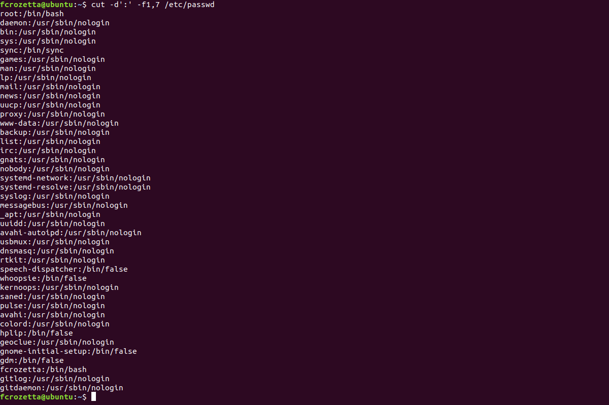
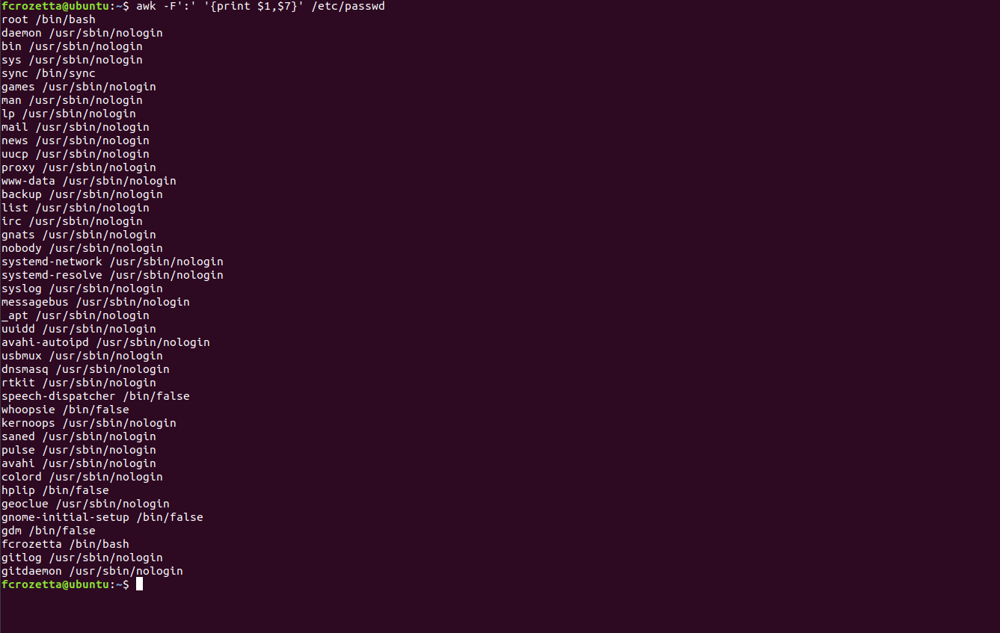

- [AWK](#awk)
    - [Introdução](#introducao)
    - [AWK vs. CUT e SED](#awk-vs-cut-e-sed)
    - [Sintaxe](#sintaxe)
    - [Exercícios:](#exercicios)
- [Desafio](#desafio)
- 
# AWK
---

O comando awk pode ser usado como um substítuto do comando _cut_, mas ele permite uma flexibilidade muito maior, e também permite um pouco de prgramação dentro do próprio comando. Nessa aula, vamos aprender como usar este comando e formatar a saída do comando.

## Introdução
O comando _awk_ nos permite formatar o conteúdo da saída, além de criar condições para fazer o _print_ das colunas desejadas. Com isso, podemos criar saídas customizadas, facilitando o envio para outro comando, ou para gerar relatórios.

## AWK vs. CUT e SED
Para realizar cortes simples, o comando cut acaba sendo mais fácil de compreender, mas saber utilizar o poder do awk, nos garante um poder maior ao criar comandos. Vamos analizar os dois comandos executando a mesma tarefa:

>Este exemplo deve buscar os nomes de usuários e qual shell ele executa por padrão
```shell
cut -d':' -f1,7
```

```shell
awk -F':' '{print $1,$7}' /etc/passwd
```

Os resultados serão, respectivamente:



No exemplo acima, a sintaxe do _cut_ ficou mais enxuta e, para estes casos mais simples, talvez o cut seja melhor. Entretanto, quando o problema a ser solucionado é mais complexo, o comando cut se mostra muito superior.

Analize este segundo problema:

>Desejamos mostrar o nome,diretório raiz, e shell de cada usuário no seguinte formato:

```shell
|User:<usuario>|Home:<raiz>|Shell:<shell>|
```

Para resolver este problema usando cut, seria necessário montar um script, armazenando as variáveis, e depois montando a string final para mostrar na tela. Outra forma de resolver seria usando o comando _sed_, seria algo próximo a:
```shell
sed -r "s/([\w\-]*)\:([a-Z0-9\,\-\/ ]*\:){4}([\w\-\/]*)\:([\w\-\/]*)/|User:\1|Home:\3|Shell:\4|/g" /etc/passwd
```

Já em _awk_:
```shell
awk -F':' '{print "|User:" $1 "|Home:"  $6 "|Shell:" $7 "|"}' /etc/passwd
```

O comando _awk_ acima deixa muito claro o que está sendo mostrado na tela, diferente do comando _sed_.

Se quisermos Dificultar ainda mais o problema, podemos mostrar os dados apenas para usuários com UID maior ou igual a 1000 (no ubuntu, geralmente os usuários do sistema começam no 1000, deixando os UIDs menores para serviços do sistema.). O UID é a terceira coluna do /etc/passwd!

Como fazer com AWK/SED ? Bom, Você pode tentar montar um no seu ambiente, se desejar.

Em _awk_, o comando fica bem simples:

```shell
awk -F':' '$3 >= 1000 {print "|User:" $1 "|Home:"  $6 "|Shell:" $7 "|"}' /etc/passwd
```

ou, usando uma segunda forma:
```shell
awk -F':' '{if ($3 >= 1000 ) print "|User:" $1 "|Home:"  $6 "|Shell:" $7 "|"}' /etc/passwd
```

Esta segunda opção pode ser melhor explorada em scripts, que veremos nas próximas aulas.

## Sintaxe
_Awk_ é uma linguagem dentro do shell, e permite que você use condicionais para expressar a melhor forma de filtrar os dados.

De uma forma geral, iremos chamar o comando, seguido de um parâmtero que identifica o caracter delimitador, seguido das linhas de código que farão a busca e corte dos dados.

Caso o parâmetro _-F_ não seja passado, o programa entenderá que o caracter delimitador é o tab (\t).

## Exercícios:

Os três primeiros exercícios são os mesmos da [aula 02 - cut](https://github.com/fc-shell-scripting/Aula02-cut), então você precisará dos mesmo arquivos que estão naquela aula. 
1. Utilize o comando awk no arquivo cadastro.csv para mostrar na tela apenas o nome e endereço dos usuários
2. Mostre o nome dos usuários do arquivo cadastro.csv para mostrar os nomes na ordem inversas do que está no arquivo.
3. carregue o nome e documento dos usuários que possuem telefone no Brasil (iniciam com +55)
4. Carregue as informações do seu usuário do sistema, a partir do arquivo passwd:
    1. Nome
    2. Grupo (quarta coluna)
    3. Diretório home
    4. Informações adicionais, se existirem
        1. O seu programa deve aceitar colocar ou não colocar as informações adicionais.
5. Carregue todos os dados do passwd, mas na ordem inversa das colunas (do home ao nome de usuário)

# Desafio
---
1. Elabora um comando que retorne os dados de cada usuário no seguinte formato:
```shell
                [<usuario>]
+-----------------------------------------------+
| UID/GID        :                   <UID><GID> |
| Diretorio home :                   <home>     |
| Caminho shell  :                   <shell>    |
+-----------------------------------------------+
```
2. Elabore um programa que faça um relatório, formatado, contendo as seguintes informações:
    1. IP interno da máquina
    2. IP externo da rede
    3. Mês/dia e horário  dos últimos 5 logins do sistema (qualquer usuário)
    4. Plataforma (x86, x86_64, etc...)

O segundo desafio possui uma complexidade alta, e portanto valerá uma pontuação bônus para a segunda metade do curso. Se você optar por não fazer o desafio, não haverá penalidades. O desafio tem valor 0.5, e cada item tem peso 0.1, somado com a formatação de peso 0.1

Boa aula,
e Boa sorte aos que forem realizar os desafios !